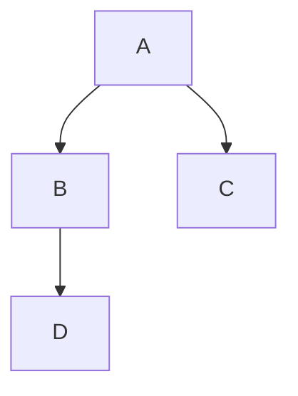

# Teste de Recursos MDX

## Tabela

| Comando | Descrição |
|---------|-----------|
| `npm run dev` | Inicia o servidor de desenvolvimento |
| `npm run build` | Gera o build de produção |

## Imagem

## Mermaid

